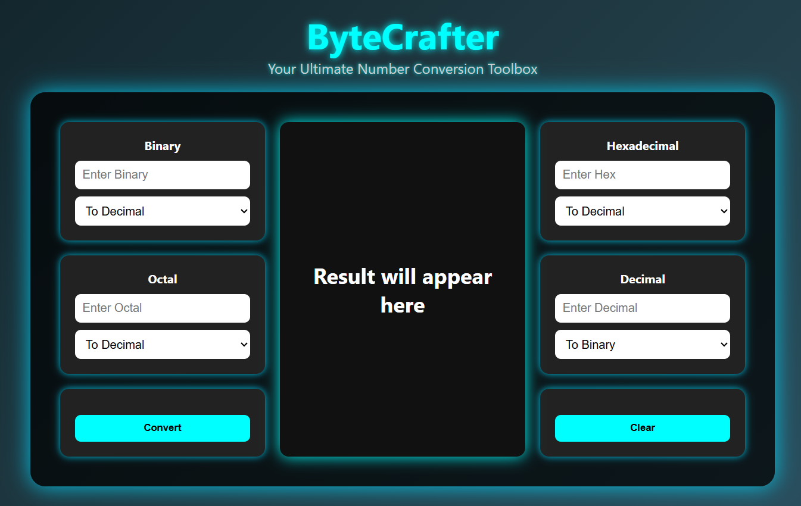

# ByteCrafter 🔢✨
**Your Ultimate Number Conversion Toolbox**

ByteCrafter is a simple yet powerful web-based tool that allows you to convert numbers between **Binary, Decimal, Octal, and Hexadecimal** formats with ease.  
Built using **HTML, CSS, and JavaScript**, this project provides a clean UI and smooth functionality.

---

## 🚀 Features
- ✅ Convert **Binary ↔ Decimal ↔ Octal ↔ Hexadecimal**
- ✅ User-friendly and responsive UI
- ✅ Real-time validation for inputs
- ✅ Clear results instantly with one click
- ✅ Built with HTML, CSS, and JavaScript only

---

## 📸 Preview
  

---

## 🛠️ Technologies Used
- **HTML5** – Structure of the application  
- **CSS3** – Styling and responsive design  
- **JavaScript (ES6)** – Logic and conversions  

---

## ⚙️ How to Run Locally
1. Clone the repository  
   ```bash
   git clone https://github.com/<your-username>/ByteCrafter.git
